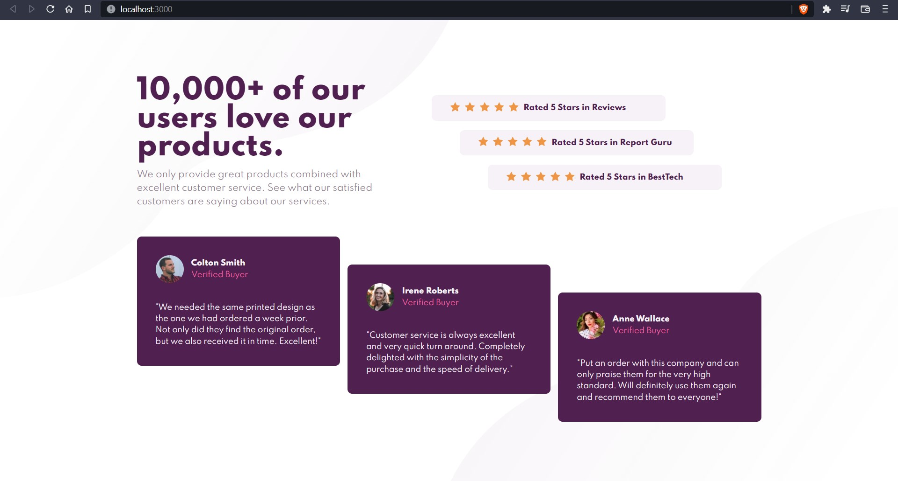
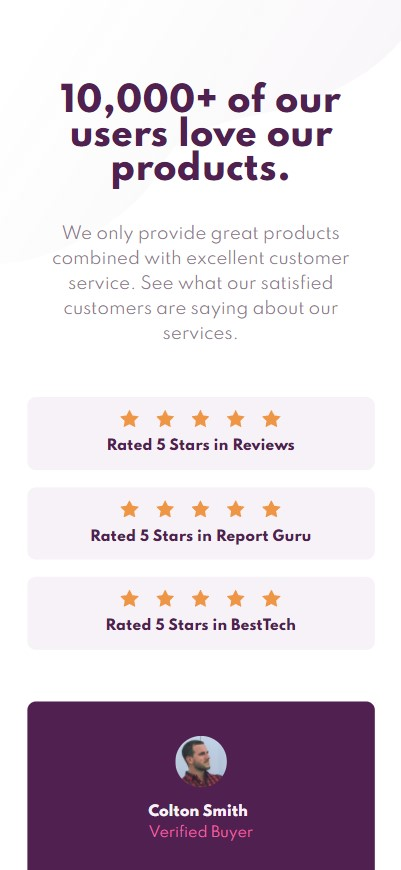
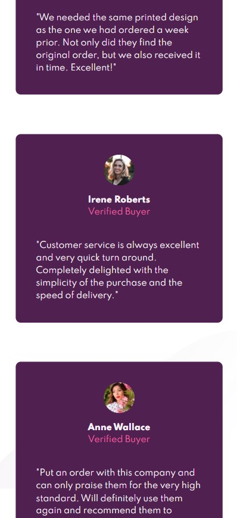

# Frontend Mentor - Social proof section solution

This is a solution to the [Social proof section challenge on Frontend Mentor](https://www.frontendmentor.io/challenges/social-proof-section-6e0qTv_bA). Frontend Mentor challenges help you improve your coding skills by building realistic projects. 

## Table of contents

- [Overview](#overview)
  - [The challenge](#the-challenge)
  - [Screenshot](#screenshot)
  - [Links](#links)
- [My process](#my-process)
  - [Built with](#built-with)
  - [Useful resources](#useful-resources)
- [Author](#author)
- [Acknowledgments](#acknowledgments)

## Overview

### The challenge

Users should be able to:

- View the optimal layout for the section depending on their device's screen size

### Screenshot

- Desktop

- Mobile

### Links

- Solution URL: [Add solution URL here](https://your-solution-url.com)
- Live Site URL: [Add live site URL here](https://your-live-site-url.com)

## My process

### Built with

- Semantic HTML5 markup
- CSS custom properties
- Flexbox
- CSS Grid
- SASS
- Mobile-first workflow

### Useful resources

- [Kevin Powell](https://youtu.be/K27WULzr2P8)
- [Coder Coder](https://youtu.be/dOnYNEXv9BM)
- [The Net Ninja](https://youtu.be/Sk5jMurFHCo)

## Author

- Frontend Mentor - [@hg8116](https://www.frontendmentor.io/profile/hg8116)
- Twitter - [@HG8116](https://www.twitter.com/HG8116)

## Acknowledgments

This was a code along with Kevin Powell, while doing this I used SASS for the first time. Other channels like Coder Coder and The Net Ninja also helped me in setting up SASS.
